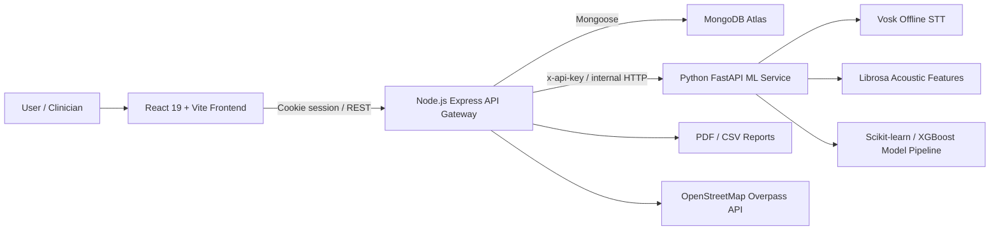

<div align="center">

# NeuroSense

### AI-assisted dementia screening with cognitive assessment, offline speech analysis, explainable ML, clinical reporting, and population analytics.

[](https://react.dev/)
[](https://expressjs.com/)
[](https://fastapi.tiangolo.com/)
[](https://www.mongodb.com/)
[](https://www.docker.com/)

**Live app:** [neurosense.tanisharora.me](https://neurosense.tanisharora.me)  
**Backend docs:** [https://api.tanisharora.me/api/docs](https://api.tanisharora.me/api/docs) | **ML docs:** `http://localhost:8001/docs` (Local)

</div>

---

## Overview

NeuroSense is a full-stack AI healthcare platform for dementia risk screening. It combines structured cognitive indicators such as MMSE, MoCA, CDR, education, activity level, and family history with acoustic speech markers extracted from a recorded voice sample. The result is a probabilistic risk score, an interpretable explanation of the model's decision, saved screening history, downloadable clinical-style reports, nearby care recommendations, and doctor/admin analytics.

This is designed as a real distributed system, not a single-page student demo. The frontend, API gateway, and ML engine are separated into independent services with dedicated responsibilities, explicit security boundaries, observability, role-based access control, test coverage, containerized deployment, and a CI/CD pipeline.

> Medical note: NeuroSense is an AI-assisted screening and triage support tool. It is not a diagnosis and must not replace evaluation by a qualified clinician.

---

## Why This Project Stands Out

| Area | What makes it stronger than a typical student project |
|---|---|
| Architecture | True multi-service design: React client, Node.js API gateway, and Python FastAPI ML service communicate through clear API contracts. |
| Privacy-aware speech AI | Uses Vosk for offline speech-to-text, avoiding third-party audio transcription APIs for sensitive voice samples. |
| Multimodal model input | Combines classic cognitive tests with acoustic features: speech rate, pause count, and pitch variation. |
| Explainability | Returns SHAP-style per-feature contributions so the risk score is not a black box. |
| Clinical workflow | Saves screening history, generates PDF reports, exports CSV data, and surfaces nearby medical facilities. |
| Production thinking | Includes RBAC, rate limits, Helmet security headers, request IDs, structured Pino logging, audit logs, health checks, and Docker deployment. |
| ML rigor | Includes model comparison, saved evaluation metrics, ROC data, confusion matrix, per-class metrics, and feature importance visualization. |
| Testing | Covers frontend unit tests, backend API tests, ML service tests, and Playwright E2E flow scaffolding. |

---

## Core Features

### Patient and Screening Flow

- Two-step cognitive and voice assessment.
- Cognitive fields include age, gender, MMSE, MoCA, CDR, education years, family history, and physical activity level.
- Browser-based microphone recording with playback before submission.
- JSON and multipart audio submission support.
- Authenticated screening route persists every result to MongoDB.

### AI and Speech Analysis

- FastAPI inference service protected by a shared `x-api-key` secret.
- Offline Vosk transcription with local acoustic model files.
- Audio normalization through `pydub` and `ffmpeg`.
- Acoustic feature extraction with `librosa` and `soundfile`.
- Model input features:
  - `age`
  - `mmse_score`
  - `cdr_score`
  - `moca_score`
  - `education_years`
  - `speech_rate`
  - `number_of_pauses`
  - `pitch_variation`
- Trained model artifact loaded from `ml-service/trained_models/dementia_model.pkl`.
- Deterministic placeholder mode keeps the app usable even if the model artifact is missing.

### Explainability and Model Evaluation

- Per-prediction SHAP explanation returned from the ML service when supported.
- Results page can render feature contribution bars showing which inputs increased or decreased risk.
- Doctor/admin model evaluation page includes:
  - Accuracy, precision, recall, F1 score, ROC-AUC
  - Confusion matrix
  - ROC curve
  - Per-class report
  - Feature importance chart

Current saved evaluation artifact:

| Metric | Value |
|---|---:|
| Accuracy | 81.5% |
| Precision | 84.79% |
| Recall | 81.78% |
| F1 Score | 83.26% |
| ROC-AUC | 89.52% |

The training pipeline generates 2,000 synthetic records, uses 1,600 for training and 400 for testing, and compares Random Forest, XGBoost, and Logistic Regression through `GridSearchCV`. These metrics are useful for engineering validation and demos, but they are not clinical validation.

### Dashboard and Reports

- Authenticated dashboard with total screenings, high-risk count, average MMSE, and monthly screening count.
- Risk score trend chart and risk distribution chart using Recharts.
- Searchable recent assessment table.
- Per-user decline analysis using linear regression over time.
- Downloadable PDF reports generated with PDFKit.
- CSV export for spreadsheet or downstream analysis workflows.

### Doctor/Admin Analytics

Role-gated analytics are available only to `doctor` and `admin` users:

- Population overview: total screenings, unique users, average risk, high-risk percentage.
- Risk distribution by level and histogram bucket.
- Screening volume grouped by day, week, or month.
- Cognitive score trends for MMSE, CDR, and MoCA.
- Population-level trajectory summary: improving, stable, declining.

### Nearby Care Recommendations

- Uses browser geolocation from the frontend.
- Backend queries OpenStreetMap/Overpass for nearby hospitals, clinics, doctors, and neurology-tagged facilities.
- Includes distance calculation with the Haversine formula.
- Falls back to deterministic mock recommendations if the external lookup fails or returns no results.

---

## Architecture



### Service Responsibilities

| Service | Stack | Responsibility |
|---|---|---|
| Frontend | React 19, Vite, Tailwind CSS 4, Recharts, lucide-react | Assessment UI, auth-aware routing, dashboards, analytics views, model evaluation charts. |
| Backend | Node.js, Express 5, Passport, Mongoose, PDFKit, Pino | Auth, sessions, API gateway, screening proxy, persistence, reports, analytics, recommendations, observability. |
| ML service | FastAPI, Pydantic, scikit-learn, XGBoost, SHAP, Vosk, librosa | Inference, audio processing, feature extraction, model metadata, model evaluation, explainability. |
| Database | MongoDB Atlas | Users, sessions, prediction results, screening audit logs. |
| Deployment | Docker, GHCR, GitHub Actions, Cloudflare Tunnel, VPS | Container builds, image registry, VPS rollout, private ML service networking. |

---

## Security and Reliability

- Session-based auth with HTTP-only cookies.
- Password hashing with `bcryptjs`.
- User roles: `patient`, `caregiver`, `doctor`, `admin`.
- RBAC middleware for doctor/admin analytics and model evaluation.
- Zod validation for auth and screening inputs.
- Global API rate limiting plus stricter auth and screening limiters.
- Helmet security headers.
- Shared API key between backend and ML service.
- ML service is intended to sit behind the backend rather than being directly exposed.
- Request IDs via UUID middleware.
- Structured backend logging with Pino and `pino-http`.
- Screening audit log records request payload, response payload, status code, latency, and error message for every screening attempt.
- Docker health checks for backend and ML service containers.

---

## Project Structure

```text
NeuroSense/
├── frontend/
│   ├── src/
│   │   ├── pages/              # Landing, dashboard, analytics, model evaluation, auth pages
│   │   ├── components/         # Screening flow, landing sections, skeletons, error boundary
│   │   ├── api/                # Domain API wrappers
│   │   ├── services/           # Central request helper
│   │   └── context/            # AuthContext
│   ├── tests/e2e/              # Playwright tests
│   └── Dockerfile
├── backend/
│   ├── routes/                 # Auth, screening, dashboard, analytics, reports, model, recommendations
│   ├── models/                 # User, PredictionResult, ScreeningAuditLog
│   ├── middleware/             # Auth, RBAC, validation, rate limiting, request IDs
│   ├── config/                 # DB, logger, Passport
│   ├── tests/                  # Jest + Supertest tests
│   └── Dockerfile
├── ml-service/
│   ├── app/
│   │   ├── routes/             # Screening, users, model info
│   │   ├── core/               # Config, security, audio processor, SHAP explainer
│   │   ├── models/             # Model loader and prediction logic
│   │   └── schemas/            # Pydantic request/response schemas
│   ├── scripts/                # Training and model comparison scripts
│   ├── tests/                  # Pytest endpoint and core tests
│   └── trained_models/         # Model, evaluation JSON, Vosk model folder
├── .github/workflows/          # GHCR build and VPS deployment workflow
├── docker-compose.yml          # Production-style backend + ML + Cloudflare Tunnel compose
└── README.md
```

---

## Main API Surface

### Backend

| Method | Endpoint | Purpose |
|---|---|---|
| `POST` | `/api/auth/register` | Create account and session. |
| `POST` | `/api/auth/login` | Local login. |
| `POST` | `/api/auth/logout` | Destroy session. |
| `GET` | `/api/auth/current-user` | Return authenticated user. |
| `POST` | `/api/screening/run` | Run cognitive/audio screening through ML service and persist result. |
| `GET` | `/api/dashboard/history` | Paginated, filterable user screening history. |
| `GET` | `/api/dashboard/summary` | User-level dashboard summary. |
| `GET` | `/api/dashboard/decline` | Per-user longitudinal decline analysis. |
| `GET` | `/api/dashboard/admin/overview` | Doctor/admin population overview. |
| `GET` | `/api/analytics/overview` | Population-level totals and averages. |
| `GET` | `/api/analytics/risk-distribution` | Risk distribution and histogram. |
| `GET` | `/api/analytics/volume` | Screening volume by day, week, or month. |
| `GET` | `/api/analytics/cognitive-trends` | MMSE/CDR/MoCA trend aggregation. |
| `GET` | `/api/analytics/decline-summary` | Population trajectory classification. |
| `GET` | `/api/reports/download/:id` | Download one PDF report. |
| `GET` | `/api/reports/export/csv` | Export screening data as CSV. |
| `GET` | `/api/recommendations/specialists` | Nearby care recommendations. |
| `GET` | `/api/model/info` | Doctor/admin model metadata proxy. |
| `GET` | `/api/model/evaluation` | Doctor/admin model evaluation proxy. |
| `GET` | `/api/docs` | Swagger UI for backend routes. |

### ML Service

| Method | Endpoint | Purpose |
|---|---|---|
| `GET` | `/` | Root health check. |
| `GET` | `/api/screening/health` | Service health check. |
| `POST` | `/api/screening/predict` | JSON or multipart prediction endpoint. |
| `POST` | `/api/screening/predict-audio` | Multipart audio compatibility endpoint. |
| `GET` | `/api/model/info` | Model version, feature order, feature importances. |
| `GET` | `/api/model/evaluation` | Saved evaluation metrics. |
| `GET` | `/docs` | FastAPI Swagger UI. |

---

## Local Development

### Prerequisites

- Node.js 20+
- Python 3.11+
- MongoDB connection string, either MongoDB Atlas or a local MongoDB instance
- `ffmpeg` available for audio conversion
- Vosk model files under `ml-service/trained_models/vosk_model/`

### 1. Clone

```bash
git clone https://github.com/tanish-arora-01/NeuroSense.git
cd NeuroSense
```

### 2. Backend Environment

Create `backend/.env`:

```env
NODE_ENV=development
PORT=5000
CLIENT_URL=http://localhost:5173
SESSION_SECRET=local-dev-session-secret
MONGO_URI=mongodb://127.0.0.1:27017/neurosense_local

ML_PREDICT_URL=http://localhost:8001/api/screening/predict
ML_SERVICE_BASE_URL=http://localhost:8001
ML_SERVICE_API_KEY=local-demo-secret-key
ML_REQUEST_TIMEOUT_MS=15000
```

### 3. ML Service Environment

Create `ml-service/.env`:

```env
ML_SERVICE_PORT=8001
DEBUG=true
MODEL_PATH=./trained_models/dementia_model.pkl
VOSK_MODEL_PATH=./trained_models/vosk_model
ALLOWED_ORIGINS=http://localhost:5000,http://localhost:5173
SECRET_KEY=local-demo-secret-key
DATABASE_URL=sqlite:///./ml_service_local.db
```

`ML_SERVICE_API_KEY` in the backend must match `SECRET_KEY` in the ML service.

### 4. Frontend Environment

Create `frontend/.env`:

```env
VITE_API_URL=http://localhost:5000
```

### 5. Run the Services

Backend:

```bash
cd backend
npm install
npm run dev
```

ML service:

```bash
cd ml-service
python -m venv .venv
.venv\Scripts\activate
pip install -r requirements.txt
uvicorn app.main:app --host 0.0.0.0 --port 8001 --reload
```

Frontend:

```bash
cd frontend
npm install
npm run dev
```

Open:

- Frontend: `http://localhost:5173`
- Backend health: `http://localhost:5000/api/health`
- Backend API docs: `http://localhost:5000/api/docs`
- ML docs: `http://localhost:8001/docs`

---

## Vosk Model Setup

The offline speech module expects the lightweight English Vosk model.

1. Download `vosk-model-small-en-us-0.15` from the official Vosk models page.
2. Extract its contents into `ml-service/trained_models/vosk_model/`.
3. Confirm the folder contains directories such as `am/`, `conf/`, `graph/`, and `ivector/`.

The repository already includes setup notes at `ml-service/trained_models/vosk_model/README.md`.

---

## Training the Model

```bash
cd ml-service
python scripts/train_model.py
```

This generates:

- `ml-service/trained_models/dementia_model.pkl`
- `ml-service/trained_models/model_evaluation.json`

The script:

- Generates 2,000 synthetic cognitive + acoustic samples.
- Splits into train/test data.
- Compares Random Forest, XGBoost, and Logistic Regression.
- Tunes hyperparameters with `GridSearchCV`.
- Saves model performance, ROC curve data, confusion matrix, class metrics, and feature importances.

---

## Testing

Frontend:

```bash
cd frontend
npm test
npm run test:coverage
npx playwright test
```

Backend:

```bash
cd backend
npm test
```

ML service:

```bash
cd ml-service
pytest tests -q -p no:cacheprovider
```

Current test coverage areas include:

- React auth context, protected route, dashboard, results, and error boundary tests.
- Backend screening proxy success, timeout, upstream error, persistence mapping, RBAC, dashboard, analytics, and recommendations tests.
- ML service endpoint tests, audio processor tests, and model prediction tests.
- Playwright E2E user-flow scaffolding.

---

## Deployment

The production-style deployment uses:

- Vercel for the frontend.
- GitHub Actions for CI/CD.
- GitHub Container Registry for backend and ML service images.
- VPS-hosted Docker Compose for backend and ML service containers.
- Cloudflare Tunnel to expose the backend without directly opening service ports.
- MongoDB Atlas for persistent application data.

Deployment workflow:

1. Push to `main`.
2. GitHub Actions builds backend and ML Docker images.
3. Images are pushed to GHCR:
   - `ghcr.io/tanish-arora-01/neurosense-backend:latest`
   - `ghcr.io/tanish-arora-01/neurosense-ml-service:latest`
4. The workflow copies `docker-compose.yml` to the VPS.
5. The VPS pulls updated images and restarts containers.
6. Cloudflare Tunnel routes public API traffic to the backend.
7. The backend calls the ML service over the private Docker network.

Required deployment secrets include:

- `VPS_HOST`
- `VPS_PASSWORD`
- `CLOUDFLARE_TUNNEL_TOKEN`
- `MONGO_URI`
- `SESSION_SECRET`
- `ML_SERVICE_API_KEY`
- `SECRET_KEY`
- `CLIENT_URL`

---

## Data Model Highlights

### `User`

- Local auth user profile.
- Role support: `patient`, `caregiver`, `doctor`, `admin`.
- Provider-ready fields for Google/GitHub account identifiers.
- Password excluded from default queries.

### `PredictionResult`

- Links each screening to a user.
- Stores patient identifier, risk score, risk level, confidence, model version, cognitive tests, notes, prediction date, and SHAP explanation.
- Indexed by user and prediction date for dashboard history.

### `ScreeningAuditLog`

- Stores every screening attempt, including failures.
- Captures user, patient ID, request payload, response payload, final status code, latency, and error message.
- Indexed for user-level and patient-level traceability.

---

## Tech Stack

| Layer | Technologies |
|---|---|
| Frontend | React 19, Vite 7, Tailwind CSS 4, React Router 7, Recharts, lucide-react, Vitest, Playwright |
| Backend | Node.js 20, Express 5, Passport, Mongoose 9, MongoDB, PDFKit, Zod, Helmet, express-rate-limit, Pino, Swagger |
| ML Service | Python 3.11, FastAPI, Pydantic 2, scikit-learn, XGBoost, SHAP, pandas, NumPy, Vosk, librosa, soundfile, pydub |
| DevOps | Docker, Docker Compose, GHCR, GitHub Actions, Cloudflare Tunnel, Vercel, VPS |

---

## Responsible Use

NeuroSense is built to demonstrate accessible AI-assisted screening, multimodal ML engineering, and clinical workflow design. It should be used as an educational and portfolio project unless validated with appropriate clinical datasets, regulatory review, privacy assessment, and professional medical oversight.

---

<div align="center">

**NeuroSense turns a screening form into a complete clinical-style workflow: assessment, speech analysis, explainable inference, reporting, analytics, and deployment.**

</div>
